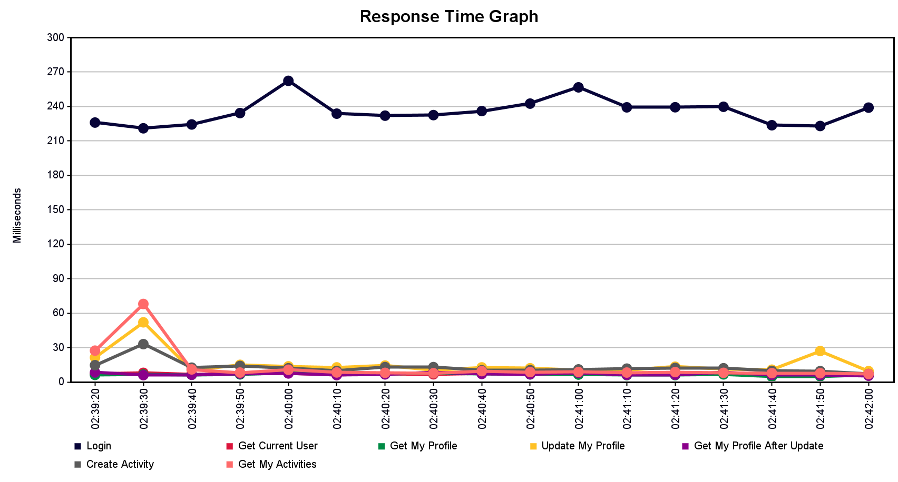
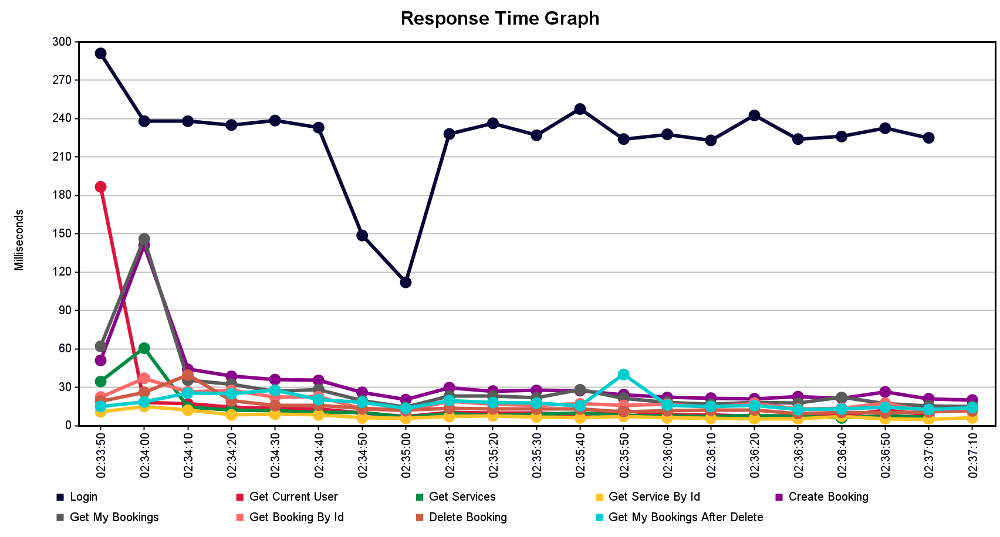
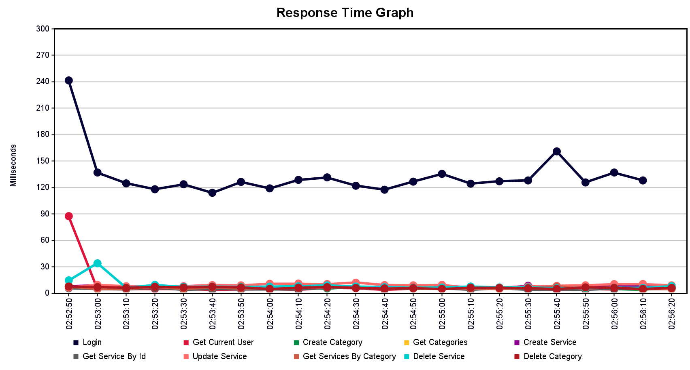

# JMeter Tests для Re-Center

Тесты нагрузки для приложения Re-Center с автоматической инициализацией тестовых данных.

## Структура

- `booking.jmx` — Тест сценария бронирования (login → browse services → create/view/delete bookings)
- `admin.jmx` — Тест сценария администратора (login → manage services)
- `profile.jmx` — Тест сценария профиля пользователя (login → update profile)
- `users.csv` — Тестовые данные обычных пользователей (5 пользователей)
- `admin-users.csv` — Тестовые данные администраторов (5 администраторов)
- `services.csv` — Тестовые услуги (домики, развлечения, спа)
- `generate-test-data.ps1` — PowerShell скрипт для инициализации данных в БД

## Подготовка к тестированию

### 1. Запустить backend в режиме test-data

```bash
# Из корневой папки проекта
.\run-backend.bat --test-data
```

Флаг `--test-data` активирует:
- Spring профиль `test-data`
- In-memory H2 БД (данные хранятся в оперативке, очищаются при перезагрузке)
- REST API для инициализации тестовых данных

### 2. Инициализировать тестовые данные

```bash
# Из папки jmeter-tests
.\generate-test-data.ps1 -Cleanup
```

Скрипт выполняет следующие шаги:

1. **Проверка доступности backend** — убеждается, что сервер запущен
2. **Очистка данных** (если флаг -Cleanup) — удаляет все существующие данные
3. **Загрузка пользователей** — читает `users.csv` и `admin-users.csv`
4. **Создание пользователей** — отправляет SQL INSERT запросы на backend
5. **Авторизация администратора** — получает JWT токен для дальнейших операций
6. **Создание категорий** — создает 3 категории (Домики, Развлечения, Спа и Wellness)
7. **Создание услуг** — создает 5 услуг из `services.csv` с привязкой к категориям

**Опции скрипта:**
```bash
# С очисткой существующих данных (рекомендуется)
.\generate-test-data.ps1 -Cleanup

# С указанием URL backend'а
.\generate-test-data.ps1 -BackendUrl "http://localhost:8080/re-center"

# Оба параметра
.\generate-test-data.ps1 -BackendUrl "http://localhost:8080/re-center" -Cleanup
```

### 3. Запустить JMeter в GUI режиме

```bash
# Из папки jmeter-tests
jmeter
```

### 4. Открыть и запустить тесты

1. File → Open → выбрать `booking.jmx` (или `admin.jmx`, `profile.jmx`)
2. Нажать зелёную кнопку "Start" (или Ctrl+Enter)

## Тестовые данные

### Обычные пользователи (CLIENT)
```
lab4_user1@example.com / lab41234
lab4_user2@example.com / lab41234
lab4_user3@example.com / lab41234
lab4_user4@example.com / lab41234
lab4_user5@example.com / lab41234
```

### Администраторы (ADMIN)
```
lab4_admin1@example.com / lab41234
lab4_admin2@example.com / lab41234
lab4_admin3@example.com / lab41234
lab4_admin4@example.com / lab41234
lab4_admin5@example.com / lab41234
```

### Категории услуг
```
1. Домики — Аренда уютных домиков на берегу озера
2. Развлечения — Активные развлечения и экскурсии
3. Спа и Wellness — Спа услуги, массажи и оздоровительные процедуры
```

### Услуги
```
- Номер люкс (категория: Домики)
- Номер стандарт (категория: Домики)
- Рыбалка (категория: Развлечения)
- Пикник на природе (категория: Развлечения)
- Спа процедуры (категория: Спа и Wellness)
```

## Конфигурация тестов

Все тесты используют:
- **Base URL**: `http://localhost:8080/re-center`
- **Thread Group**: 5 потоков, 10 итераций
- **Ramp-up**: 30 секунд
- **Global HTTP Cookie Manager** — для сохранения сессий
- **Global Authorization Header Manager** — для передачи JWT токена

## REST API для инициализации данных

Доступны только в режиме `--test-data`:

### Выполнить SQL запрос
```bash
POST /api/test-data/execute
Content-Type: application/json

{
  "sql": "INSERT INTO Users (...) VALUES (...); INSERT INTO Users (...) VALUES (...);"
}
```

### Очистить все данные
```bash
DELETE /api/test-data/cleanup
```

### Проверить статус
```bash
GET /api/test-data/status
```

## Полный workflow

```bash
# Терминал 1: Запустить backend
.\run-backend.bat --test-data

# Терминал 2: Инициализировать данные (ждём, пока backend полностью загрузится)
cd jmeter-tests
.\generate-test-data.ps1 -Cleanup

# Терминал 2: Запустить JMeter
jmeter

# В JMeter GUI: открыть тест и нажать Start
```

## Структура проекта

```
jmeter-tests/
├── booking.jmx              # Тест бронирования
├── admin.jmx                # Тест администратора
├── profile.jmx              # Тест профиля
├── users.csv                # Данные пользователей
├── admin-users.csv          # Данные администраторов
├── services.csv             # Данные услуг
├── generate-test-data.ps1   # Скрипт инициализации
└── README.md                # Этот файл
```

## Результаты проведённых тестов

В папке `results/` находятся скриншоты результатов тестирования:

### Тест профиля пользователя (profile.jmx)


Тест проверяет:
- Авторизацию пользователя
- Получение профиля
- Обновление данных профиля
- Загрузку истории действий

### Тест бронирования (booking.jmx)


Тест проверяет:
- Авторизацию пользователя
- Просмотр доступных услуг
- Создание бронирования
- Просмотр своих бронирований
- Отмену бронирования

### Тест администратора (admin.jmx)


Тест проверяет:
- Авторизацию администратора
- Управление услугами (создание, обновление, удаление)
- Управление категориями
- Управление скидками и акциями
